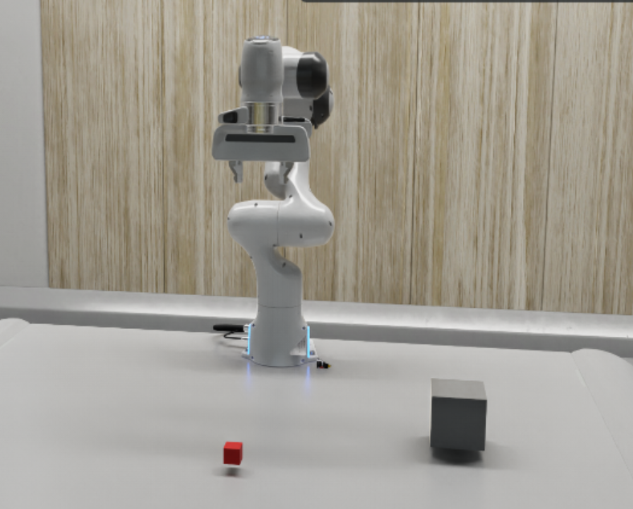
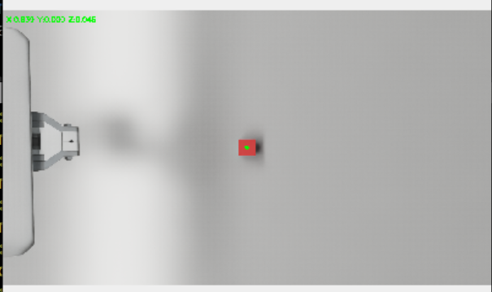

# Simple Pick-and-Place: Isaac Sim + MoveIt2

A pick-and-place implementation using **NVIDIA Isaac Sim** for simulation and **MoveIt2** for motion planning, built on **ROS 2 Jazzy**.


## Table of Contents

- [Description](#description)
- [Setup](#setup)
- [Usage](#usage)
- [Demos](#demos)
  - [Demo 1: Isaac Sim & RViz](#demo-1-isaac-sim--rviz)
  - [Demo 2: Isaac Sim + MoveIt2 (Cartesian Motion)](#demo-2-isaac-sim--moveit2-cartesian-motion)
  - [Demo 3: Pick-and-Place](#demo-3-pick-and-place)
  - [Demo 4: Pick-and-Place](#demo-4-pick-and-place with camera)

## Description

This workspace connects Isaac Sim to MoveIt2 through a ros2_control
bridge, allowing motion plans generated in MoveIt2 to drive a simulated robot
in Isaac Sim for pick-and-place tasks.

## Setup

Clone into the `src` folder of your ROS 2 workspace:

```bash
cd ~/jazzyws/src
git clone https://github.com/adnankhalid-robotics/simple_pnp_isaac_sim_moveit2.git
```

Install dependencies and build:

```bash
cd ~/jazzyws
rosdep install --from-paths src --ignore-src -r -y
colcon build
source install/setup.bash
```

## Usage

1. Launch Isaac Sim with the robot scene loaded.
2. Start the MoveIt2 planning and control stack:

```bash
source ~/jazzyws/install/setup.bash
ros2 launch isaac_moveit_package <your_launch_file>.launch.py
```

## Demo # 1 : Isaac Sim & Rviz

Basic teleoperation — plan a goal pose in RViz and mirror it in Isaac Sim.

1. In Isaac Sim, go to **Menu → Window → Examples → Robotics Examples → ROS 2 → MoveIt → Franka MoveIt → Load Sample Scene**.
2. Launch the bridge:

```bash
ros2 launch isaac_moveit_package isaac_moveit.launch.py
```

3. In RViz, drag the goal robot (shown in orange) to a target pose, then click **Plan and Execute**.
4. The robot in Isaac Sim and RViz will move identically.


## Demo # 2 : Isaac Sim + Moveit2

Programmatic motion to a predefined Cartesian pose.

1. In Isaac Sim, go to **Menu → Window → Examples → Robotics Examples → ROS 2 → MoveIt → Franka MoveIt → Load Sample Scene**.
2. Launch the motion node:

```bash
ros2 launch isaac_moveit_package motion.launch.py
```

3. This runs `src/motion.cpp`, moving the robot to a predefined pose in Cartesian space.
4. Robot motion in RViz and Isaac Sim stays synchronized.


## Demo # 3 : Pick-and-Place

pick-and-place.

1. Load `panda_isaac.usd` in Isaac Sim and start the simulation.
2. Launch the pick-and-place node:

```bash
   ros2 launch isaac_moveit_package cube_gripper.launch.py
```

3. This runs `src/cube_gripper.cpp`.
4. Verify the exposed service in another terminal:

```bash
   ros2 service list
```
   You should see `/cube_pose` in the output.
   
## Demo # 4 : Pick-and-Place with camera 

Pick and Place with perception module.



1. Load `panda_isaac.usd` in Isaac Sim and start the simulation.
2. In one terminal run the cube detector node as given below.

```bash
ros2 run isaac_moveit_package cube_detector.py
```
3. In second terminal run the cube detector node as given below to check the service is running. If that works then proceed with step 4.

```bash
ros2 run isaac_moveit_package cube_client_position_node 
```

4. Verify the detected cube through this command in the second terminal 

```bash
ros2 run image_view image_view --ros-args -r image:=/red_cube/image
```



5. In the second terminal launch the pick-and-place node witht the command below.

```bash
   ros2 launch isaac_moveit_package cube_gripper_camera.launch.py
```


